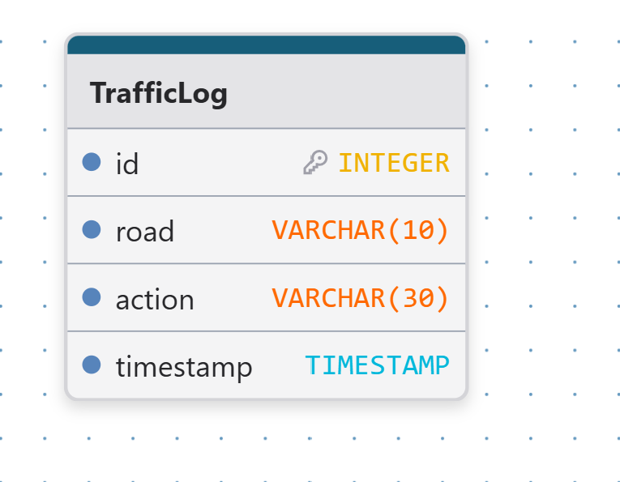

# 🚦 Smart Light Control System

- Control light road ( A, B, C, D)
- Control 2 light direction ( AC, BD )
- Set Timer for green light road
- Real time data visualization

# 🏆 Our Vision :

- 🚗 Develop an Traffic Light control system to reduces traffic jam.
- 📊 Flexible and easy to use with good User Interface with Data visualization on Most jam traffic.
- 🛣️ Sustainability system with resuable code that support decision making.
- 🤖 AI that use CCTV camera to manage traffic.

# 🥴⛓️ Related Reposatory
- Comming soon....

# 🖊️ Supervisor
- Sek Socheat

# 👥 Contributor

- Sorn Vireaksothearith ( FullStack Developer & Operation / Technical Lead)
- Neang Saksopheaktra ( Data Analysis & Resources Management )
- Boran Chanvicheka ( Electric Circuit Analysis )
- UY Rathbanditpitou ( Arduino System Developer )  

# 👥 Partnership

- Ang Vannchannida (Project Lead)
- Lor Puthichenda (Research and Business Analysis)
- Teng Soksereyvathna (Product Manager)

# 🚦 DataSchema

